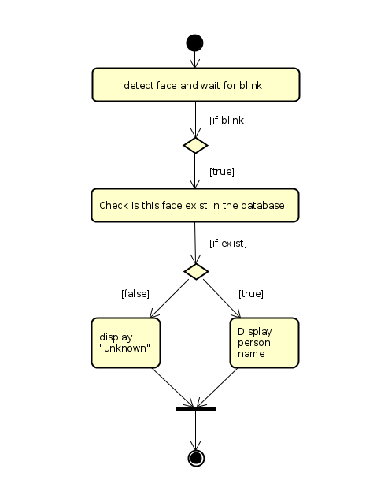

# Face-Recognition
This project is composed to 3 parts:
- **FaceNet** a face recognition system.
- **Liveliness Net** a a security system for face recognition.
- **Real Time Implementation** a real time face recognition system.

## FaceNet
FaceNet learns a neural network that encodes a face image into a vector of 128 numbers. 
By comparing two such vectors, you can then determine if two pictures are of the same person.

**Encoding model** : Inception 

**Loss**: Triplet loss

## Liveliness Net
Face recognition systems can be circumvented simply by holding up a photo of a person to the face recognition camera.
In order to make face recognition systems more secure, we need to be able to detect such fake/non-real faces using *Liveliness Net*.

**Problem**: Binary classification of eye status.

**Dataset** :  [Closed Eyes In The Wild (CEW) dataset](http://parnec.nuaa.edu.cn/_upload/tpl/02/db/731/template731/pages/xtan/ClosedEyeDatabases.html)

**Model** : LeNet-5 

## Real Time Implementation
Combine the two previous networks, and implementing real time feature using opencv. 

**Idea** : We won't confirm the face if it's detected until the eyes blink.

**Face detection task** : openCV pre-trained Haar-cascade classifier.

